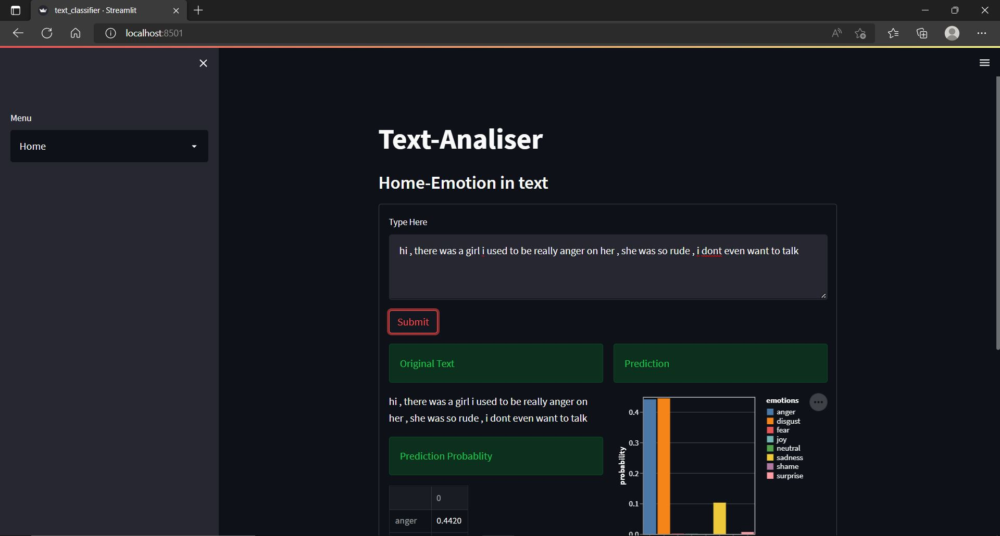
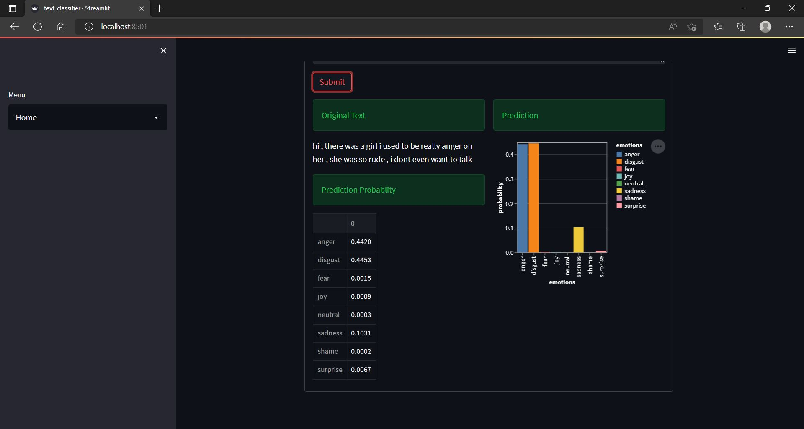
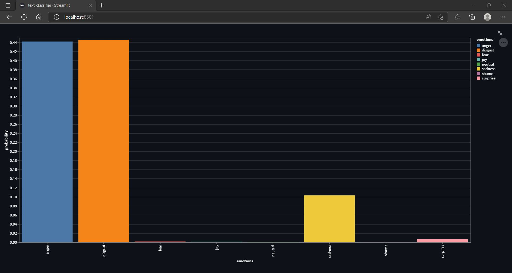
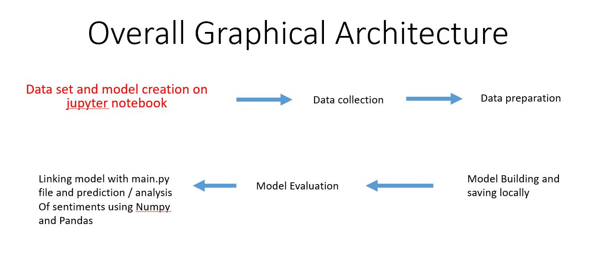

# Semantic Sense - Emotion Analyzer Web App


## Overview
The **Semantic Sense - Emotion Analyzer Web App** utilizes advanced machine learning techniques to analyze and classify emotions expressed in textual input. Designed with user experience in mind, this application provides an intuitive interface for users to input text and receive emotion predictions. Its capabilities make it particularly valuable for sentiment analysis, feedback interpretation, and mental health insights.

---

## Requirements
To successfully run the Emotion Analyzer Web App, ensure that you have the following prerequisites:

### Software Environment
- **Anaconda Distribution**: A widely used platform for managing Python environments and packages.
  - **Spyder IDE**: An integrated development environment tailored for scientific programming.
  - **Jupyter Notebook**: A web application for creating and sharing live code, equations, visualizations, and narrative text.

### Required Libraries
Install the following Python libraries. If they are not already installed in your Anaconda environment, use the pip command to install them:

- **Streamlit**: For building the web app interface.
- **NumPy**: For performing numerical computations.
- **Pandas**: For data manipulation and analysis.
- **Scikit-learn**: For implementing machine learning algorithms.
- **Seaborn**: For enhanced data visualization.
- **Joblib**: For saving and loading Python objects efficiently.
- **Neattext**: For cleaning and preprocessing text data.
- **Altair**: For creating declarative statistical visualizations.

```bash
pip install streamlit numpy pandas scikit-learn seaborn joblib neattext altair
```

---

## Outputs
The application generates various outputs based on user input. Below are visual examples demonstrating the outputs:

<div align="center">
    
    <br>
    
    <br>
    
</div>

These images showcase the graphical representation of emotions detected in the provided text, highlighting the app's ability to visualize complex emotional data effectively.

---

## Project Architecture
The architecture of the Emotion Analyzer Web App is designed to facilitate efficient data processing and enhance user interaction. The following diagram outlines the key components and their interactions:

<div align="center">
    
</div>

---

## Model Preparation
The preparation of the emotion analysis model involves several critical steps to ensure accuracy and reliability:

1. **Data Collection and Loading**:
   - Gather a comprehensive dataset containing text samples and their corresponding emotion labels.
   - Load the dataset in CSV format for further processing.

2. **Data Analysis**:
   - Conduct exploratory data analysis (EDA) to understand the dataset's structure, distribution, and identify patterns that can inform model training.

3. **Data Cleaning**:
   - Remove unnecessary characters and noise from the text data, including:
     - Numbers
     - Special symbols
     - Stop words (common words that contribute little meaning)
     - User handles (e.g., Twitter usernames)
   - This step ensures that the input text is clean and relevant for analysis.

4. **Model Development**:
   - Utilize **Linear Regression** as the primary algorithm to build the model. This process involves:
     - **Labeling**: Assigning emotion labels to the training data.
     - **Fitting**: Training the model on the dataset to capture the relationships between text and emotions.
     - **Splitting**: Dividing the data into training and testing sets to evaluate model performance.
     - **Training and Testing**: Running the model on the training data and validating its accuracy with the test set.

5. **Model Evaluation**:
   - Assess the model’s accuracy by inputting various random texts and analyzing its predictions.
   - Make necessary adjustments to improve performance based on evaluation metrics.

6. **Model Saving**:
   - Once the model achieves satisfactory accuracy, save it using Joblib for later use in the web application.

---

## Frontend Development
The frontend of the Emotion Analyzer Web App is designed for user-friendly interaction and effective data visualization:

1. **Model Integration**:
   - Load the trained emotion analysis model by specifying its absolute file path to ensure seamless functionality.

2. **User Interface Design**:
   - Define a clear and engaging title for the application that reflects its purpose.
   - Implement a dropdown menu for easy navigation (e.g., Home, About).

3. **Input Area**:
   - Create a text input area where users can enter their text for emotion analysis.

4. **Visualization**:
   - Present the predicted emotions and their probabilities using bar graphs and other visual tools for easy interpretation.

5. **Input Validation**:
   - Implement robust exception handling to manage invalid inputs, such as:
     - Numeric-only entries
     - Excessive whitespace
   - This ensures that the application maintains accuracy in predictions and overall functionality.

---

<h1 align="center">The End!</h1>
